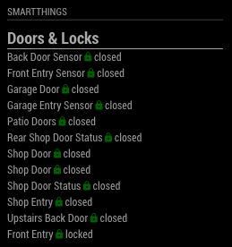

# MMM-Smartthings

This is a module for the [MagicMirror²](https://github.com/MichMich/MagicMirror/).

MagicMirror module that connects to the Samsung Smartthings api to display device status information.

## Example



## Dependencies

* An installation of [MagicMirror<sup>2</sup>](https://github.com/MichMich/MagicMirror)
* npm
* [smartthings-node](https://www.npmjs.com/package/smartthings-node)

## Installation
### Setup the MagicMirror module
```bash
cd ~/MagicMirror/modules
git clone https://github.com/buzzkc/MMM-Smartthings.git
cd MMM-Smartthings
npm install
```

### Using the module

To use this module, add the following configuration block to the modules array in the `config/config.js` file:
```js
var config = {
    modules: [
        {
              module: "MMM-Smartthings",
              position: "top_left",
              header: "Smartthings",
              config: {
                personalAccessToken: 'your_smarthings_api_key',
                capabilities: [
                    'contactSensor',
                    'lock'
                ],
                title: "Doors & Locks",
                excludedDeviceNames: [
                    'Sense-', // Contains this text
                    'Virtual Lock Test' // Or is a specific device label
                ]
              }
        }
    ]
}
```

## Configuration options

| Option                | Description
|-----------------      |-----------
| `personalAccessToken` | *Required* Setup your personal access token at https://account.smartthings.com/tokens
| `capabilities`        | *Required* An array of device capabilities to display statuses for. Supported capabilities: "switch", "contactSensor", "lock", "temperatureMeasurement", "relativeHumidityMeasurement", & "motionSensor"
| `updateInterval`      | *Optional* The number of milliseconds between updates<br>**Type:** `int`(milliseconds) <br>Default 30000 milliseconds (30 seconds)
| `title`               | *Optional* The sub-heading title for device list
| `excludedDeviceNames` | *Optional* An array of device names or strings contained in the device label, can be excluded by containing a given word or the full name. Be more specific if devices you want to see are getting excluded.
| `tempLowValue`        | *Optional* The low threshold for temperature monitoring Default: 65 **Type:** `int`
| `tempHighValue`       | *Optional* The high threshold for temperature monitoring Default: 80 **Type:** `int`
| `title`               | *Optional* The sub-heading title for device list


## Future Enhancements
* Refactor to allow multiple instances of module.
* Add additional capabilities: https://docs.smartthings.com/en/latest/capabilities-reference.html
* Filter by location, currently all devices for all locations shown.
* ~~Filter out by device name.~~


## Thanks To
* MichMich for developing [MagicMirror<sup>2</sup>](https://github.com/MichMich/MagicMirror)
* To the following for feedback and support sdetweil, cowboydude, & johnnyboy
* Examples on aduyng's [MMM-IOTStatus project:](https://github.com/aduyng/MMM-IOTStatus)
